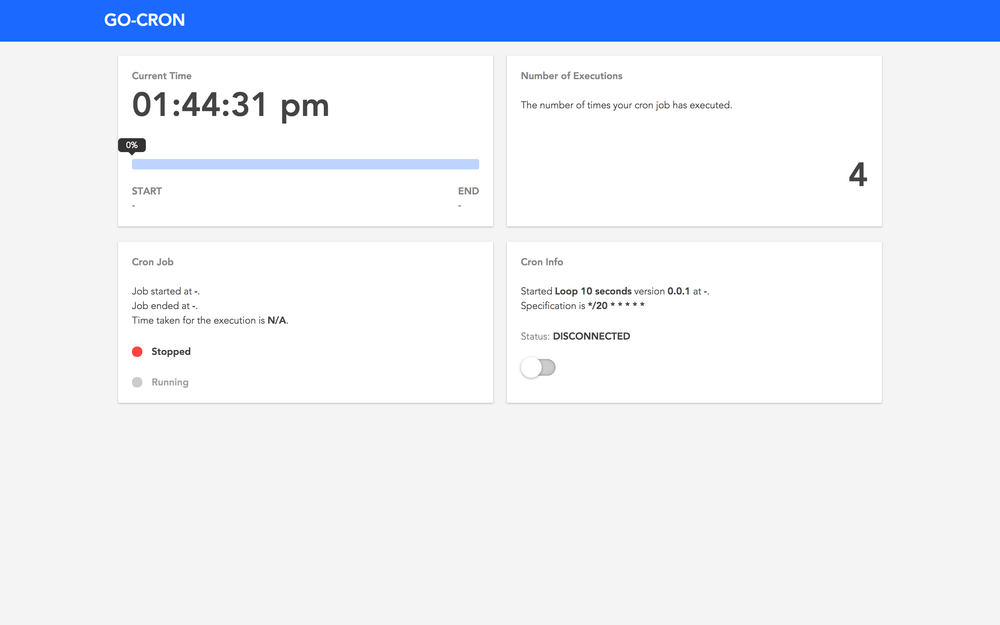
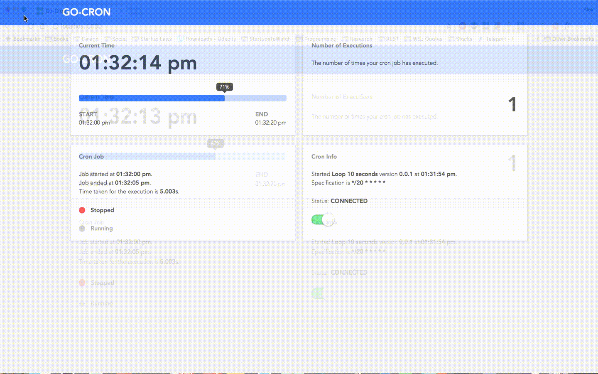

# Go-Cron

Simple cron API with UI to monitor your cron application.





## Update the cron specs

You can update the cron duration through a POST api.
```bash
$ curl -XPOST -d '{"username": "john.doe", "password": "123456"}' http://localhost:8080/crons\?spec\=\*%2F20%20\*%20\*%20\*%20\*%20\*
```

## Stop the cron
You can stop the cron execution.

```bash
$ curl -XPOST -d '{"username": "john.doe", "password": "123456"}' http://localhost:8080/crons/stop
```

## Start the cron
You can stop the cron execution.

```bash
$ curl -XPOST -d '{"username": "john.doe", "password": "123456"}' http://localhost:8080/crons/start
```